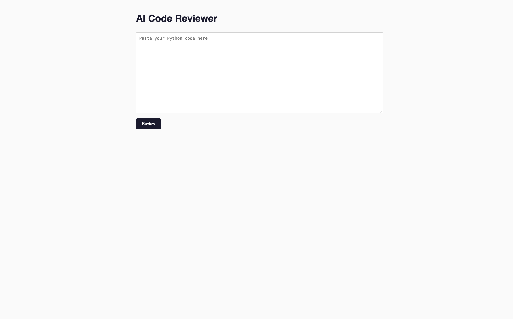

# AI Code Reviewer

A tool that uses Claude to review Python code and surface concrete issues — bugs, style problems, and design suggestions. Built as both a command-line tool and a deployed web app.

**Live demo:** https://ai-tool-jhii.onrender.com
*(hosted on Render's free tier — if it's been idle a while, the first load can take 30-60 seconds to wake up)*

## Features

- Paste Python code into a web form and get back a structured AI-generated code review
- Review output rendered as clean formatted HTML (headers, bold text, syntax-highlighted code blocks)
- Sanitized output to prevent unsafe HTML from being rendered
- A command-line version (`review.py`) that supports interactive follow-up reviews without restarting
- Graceful error handling for missing files, bad input, and API failures

## Tech stack

- Python, Flask
- Anthropic API (Claude) for code review generation
- `markdown` + `nh3` for safely rendering formatted review output
- Deployed on Render with `gunicorn`

## Running it locally

Clone the repo and set up a virtual environment: